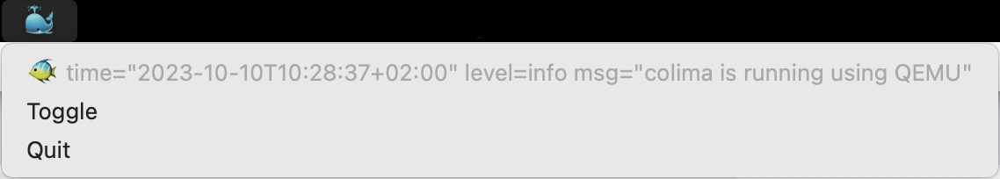

# 🐳 `Kalimba` == `Co'li`ma `M`enu `Ba`r

> 🌱 This is an early WIP, more information coming soon ✨

`kalimba` is a tiny menu bar applicaiton allowing to monitor and toggle
the status of [`colima`](https://github.com/abiosoft/colima) with a basic GUI
written using [`rumps`](https://github.com/jaredks/rumps).

## Usage

### Start the `kalimba` menu bar app

```bash
$ kalimba
INFO:kalimba.kalimba:Starting the kalimba app... 🎶
...
```

> 🧙 and it launches the `kalimba` 🐳 application! ✨
>
> 

### Getting `kalimba` help

```bash
$ kalimba --help
Usage: kalimba [OPTIONS] ...
```

## Installation

### Give it a local try

Starting right away using [`poetry`](https://python-poetry.org/):

```bash
poetry install # installs kalimba in poetry's environment
poetry run kalimba --help # shows some tips-and-tricks
poetry run kalimba # starts the app
```
<!-- markdownlint-disable MD033 -->
<details>
<summary><i>More temporary installation options 👀</i></summary>

#### Install via local pypiserver

1. Configure `poetry`:

    ```bash
    poetry config repositories.local http://localhost 
    ```

2. Start the local [`pypi-server`](https://github.com/pypiserver/pypiserver)

    ```bash
    docker run --rm -p 80:8080 pypiserver/pypiserver:latest run -P . -a . -vvv
    ```

3. Build and publish the project

    ```bash
    $ poetry build
    Building kalimba (<version>)
     ...
     - Built kalimba-<version>-...
    $ poetry publish -r local
    Publishing kalimba (<version>) to local
    ...
    $ pip install --user -i http://localhost/ kalimba
    ...
    Successfully installed ... kalimba-<version> ...
    ```

4. Check direct access to `kalimba` CLI

    ```bash
    $ kalimba --help

    Usage: kalimba [OPTIONS]
    ...
    ```

</details>
<!-- markdownlint-enable MD033 -->
